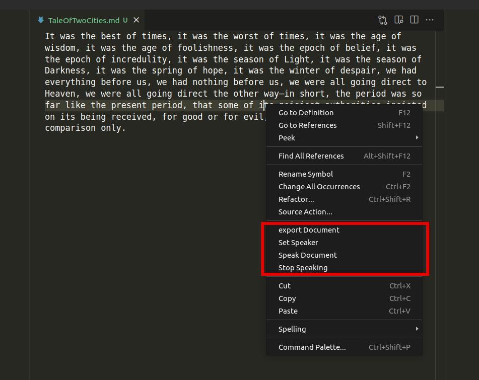
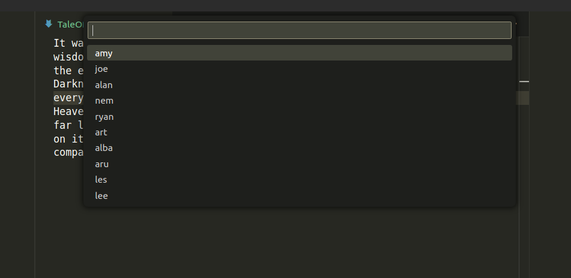

# VSCode Speech with Piper

This repo  is a fork of [mattbierner/vscode-speech](https://github.com/mattbierner/vscode-speech), a simple text to speech extension for vs-code.

My fork replaces Say.js text-to-speech implementation with [Piper](https://github.com/rhasspy/piper), a fast, local neural text to speech system. The engine is called by some bash scripts and uses hard coded link to the voice models I have installed on my system.

This is only running on linux at the moment. I created it because the default text to speech voice on linux sounds terrible.

## About
VSCode Speech adds basic text-to-speech functionality to the VSCode editor using ~~your operating system's built-in text-to-speech facilities~~ piper, a local neural text to speech system. It can either read the entire current document, or just the currently selected text.

## Voice selection menu

Currently, these voices are I have on my own system, to recreate this you will need to download the models seperatly from [here](https://huggingface.co/rhasspy/piper-voices/tree/v1.0.0). You can also set the voice in your vscode settings. 

## Configuration

- speech.voice
- speech.subsitiution
- ~~speech.speed~~ (not implemented) 

## Credits

- vscode-speech, https://github.com/mattbierner/vscode-speech
-  Piper,  https://github.com/rhasspy/piper